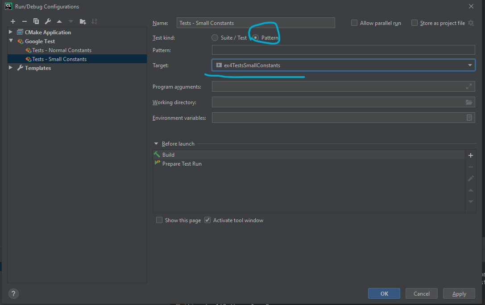
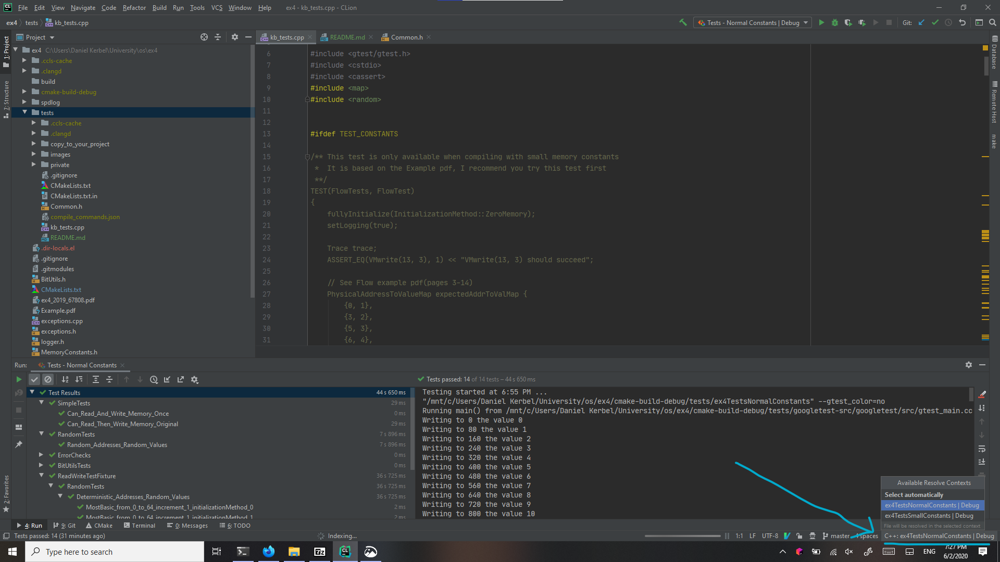

# Tests for OS Exercise 4, Exercise 2020 - Hierarchial page tables

## Requirements

These tests should work in Linux systems including the Aquarium, and on Windows with WSL2. (Which recently came out, I highly recommend you try it)

I haven't tested them on Mac or with normal Windows, and I have no idea if they work there. If you're having problems and you're sure you followed
the instructions, try them on the Aquarium.

## Installation instructions

1. From your project's root, perform `git clone https://github.cs.huji.ac.il/danielkerbel/tests_os_ex4.git tests`

2. Copy all files from `copy_to_your_project/` into your project's root directory.

   These include PhysicalMemory with some changes that allow the tests to track evict/restore operations,
   as well as an alternative set of memory constants, depending on preprocessor flag.
   
3. Use the following for `YOUR_PROJECT_ROOT/CMakeLists.txt`:

    ``` cmake

    cmake_minimum_required(VERSION 3.1)


    # Project configuration
    project(ex4 VERSION 1.0 LANGUAGES C CXX)


    set(vm_source_files
            VirtualMemory.h VirtualMemory.cpp
            PhysicalMemory.h PhysicalMemory.cpp
            MemoryConstants.h
    # ------------- You may only modify the following section ----------- #
            # add other source files here
            )


    # you can add -O2 or other flags, not necessary though
    set(vm_compile_options -Wall -Wextra -g)


    # ------------ Do not modify anything below these lines ------------- #

    set(vm_link_libraries)
    set(vm_compile_definitions INC_TESTING_CODE)

    set(USE_SPEEDLOG OFF)

    if(USE_SPEEDLOG)
        add_subdirectory(spdlog)
        list(APPEND vm_link_libraries spdlog::spdlog)
        list(APPEND vm_compile_definitions USE_SPEEDLOG)
    endif()


    add_library(VirtualMemory ${vm_source_files})
    set_property(TARGET VirtualMemory PROPERTY CXX_STANDARD 11)
    target_compile_options(VirtualMemory PUBLIC ${vm_compile_options})
    target_link_libraries(VirtualMemory PUBLIC ${vm_link_libraries})
    target_compile_definitions(VirtualMemory PUBLIC ${vm_compile_definitions})

    # the only difference between these targets is that the one below has
    # has 'TEST_CONSTANTS' as a preprocessor variable, which is used in 'MemoryConstants.h'

    add_library(TestVirtualMemory ${vm_source_files})
    set_property(TARGET TestVirtualMemory PROPERTY CXX_STANDARD 11)
    target_compile_options(TestVirtualMemory PUBLIC ${vm_compile_options})
    target_link_libraries(TestVirtualMemory PUBLIC ${vm_link_libraries})
    target_compile_definitions(TestVirtualMemory PUBLIC ${vm_compile_definitions} TEST_CONSTANTS)

    # Add tests subdirectory
    add_subdirectory(tests)


    set(CMAKE_EXPORT_COMPILE_COMMANDS ON)

    ```

    You may only modify `vm_source_files` and optionally `vm_compile_options`, you must not touch anything else in this CMakeLists.txt.
    
    
## How are the tests organized, how do they work

Firstly, you may have noticed that there are two library targets in the above CMakeLists, and two test executable targets in the tests CMakeLists

- The first executable, `ex4TestsNormalConstants`, is linked with the library target `VirtualMemory`
  and uses the same constants in the default `MemoryConstants.h` provided in the exercise
  
- The second executable, `ex4TestsSmallConstants`, is linked with the library target `TestVirtualMemory`
  and uses smaller constants that correspond to the example in the flow example PDF.
  When compiling in this mode, the preprocessor variable `TEST_CONSTANTS` is defined.
  
The tests file (`kb_tests.cpp`) uses `TEST_CONSTANTS` to determine whether to compile `FlowTest` or 
`Can_Read_And_Write_Memory_Once` - depending on which executable target is being compiled:


- `Can_Read_And_Write_Memory_Once` is a very basic test, using the normal constants, it writes a value
  and then reads it, ensures the read value matches the written value, and then it checks the physical
  memory structure to ensure that the proper page tables were created.
  
  It only involves the second case for handling page faults(using max_frames_index + 1),
  and doesn't involve the first case(using a frame of zeros) or the third case(page eviction),
  so it's a good way to test the main logic of your address translation before handling page faults in
  more complex scenarios.
  

- `FlowTest` is the most detailed/interpretable test, it does the same operations as in the flow PDF, it checks
  that after each VMwrite/read operation, the gotten physical memory contents are equal to the expected ones.
  
  It even checks ensures that some of the `PMrestore` and `PMevict` functions were called
  

There are also tests that are more-or-less independent from the constants:

- `Deterministic_Addresses_Random_Values` is a parameterized test - it is basically a template
  and there are various instantiations of this test with different parameters, see `TESTS_PARAMETERS`
  
  Note, not all parameters work when using small constants, in those cases, these tests will be skipped
  during runtime. In CLion, these will have green marks, in the terminal, it will say `SKIPPED` - that's
  not an error, but don't get confused if they later fail when running with normal constants.
  
-  `Can_Read_Then_Write_Memory_Original` is based on the SimpleTest provided in the example but with
   minor modifications.
   
   (It's also very similar to the one above)
   
- `Random_Addresses_Random_Values` is similar to the parameterized test, but instead of using increasing
  virtual addresses in a loop, it generates them randomly.
  
  This is probably the strongest test, but also the least interpretable, so I recommend focusing on
  other tests first as they're easier to debug


Note, the folder `private` contains private tests for my own implementation, they don't belong to this test suite, so ignore them since you can't use them anyway.
(I do recommend writing such tests on your own, especially for testing tricky bitwise operations)

## Running the tests

Firstly, it is possible to use glob patterns(like regexes but simpler) to choose tests, whether running via CLion or terminal.
For example, some valid patterns are `*Original*`, `*Flow*`, `*Random_Addresses*`, don't forget to choose the correct test executable

**Note** - in the glob pattern, always surround them with asterisks, because the full test name is much longer than what I specified above.


### Via Terminal

1. First, compile the program:

    ``` shell
    cd YOUR_PROJECT_ROOT
    rm -rf cmake-build-debug
    mkdir cmake-build-debug
    cmake ..
    make -j 4
    ```
    
    (the `rm` and `cmake` are only necessary whenever you transfer between systems, otherwise `make` should be sufficient)
    
2. Run the test executable:

   - `cd YOUR_PROJECT_ROOT/cmake-build-debug/tests/`
   
   - Run either `./ex4TestsNormalConstants` or `./ex4TestsSmallConstants`
     (I recommend starting with `./ex4TestsSmallConstants` as it's faster)
     
     You can add glob patterns via `--gtest_filter="*PATTERN*"`, for example, some useful patterns:
     - `./ex4TestsSmallConstants --gtest_filter="*Flow*"`
     - `./ex4TestsSmallConstants --gtest_filter="*Random_Addresses*"`
     - `./ex4TestsNormalConstants --gtest_filter="*Once*"`
     - `./ex4TestsNormalConstants --gtest_filter="*Original*"`
     - `./ex4TestsNormalConstants --gtest_filter="*Random_Addresses*"`

### Via CLion

1. First, reload CMake and compile as follows:
   
   - `File | Reload CMake Project`
   - `Build All in 'Debug'`

2. Add test configurations via `Run | Edit Configurations... | + | Google Test`,
   fill them as follows:
   
   - Name: some name of your choice for the test
   - Test kind: `Pattern`
   - Pattern: keep this empty to run all tests for the target, or a glob pattern as explained above.
   - Target: either `ex4TestsNormalConstants` or `ex4TestsSmallConstants` - I recommend you writes
     at least two
     
   Here's an example: 
   
## Tip - editing test files in CLion

When editing `kb_tests.cpp`, you'll probably have some block of code greyed out and syntax checking and such won't be available,
this is because there's conditional compilation based on `TEST_CONSTANTS` preprocessor variable.

Therefore, you can tell CLion in which configuration you are by changing the "resolve context" in the bottom right corner, see
example: 

Note that whenever you run a test executable, CLion will automatically change to the proper resolve context, e.g, if you run
`ex4TestsNormalConstants`, then `FlowTest` will become greyed out and `Can_Read_And_Write_Memory_Once` will become normal.


## General tips

Debugging this exercise can be very tricky, while the tests themselves are very simple(after all, there are only 2 functions you need to implement),
there is a lot going on under the hood.

Therefore, don't rely on these tests too much, and make your own tests, you should also test the internal parts of your implemenation wherever possible
`FlowTest` is a good test because you can draw the entire page table hierarchy on paper and visualize it, just like the PDF does.
If you pass this test but fail more complicated examples, try creating similar tests for slightly more complicated scenarios.

Some general tips are:


  

- Use many, many many asserts in your program. For reference, I have 38 asserts not including those in PhysicalMemory. 
  These have helped me uncover many bugs and better understand the exercise.

- Test the internal parts of your implementation where possible. For example, it's easy to create unit tests for bitwise operations, and I recommend
  you do so early on, because bugs involving them can be extremely hard to figure out.
  
- Make your own tests, test more complicated scenarios. `FlowTest` is a good example, you can expand on it or
  create more complicated scenarios (perhaps with the normal test constants)
    
- Use extensive logging in your program. While std::cout/printfs can work, I personally recommend
  [spdlog](https://github.com/gabime/spdlog), which has some nice features:

  - Uses format strings, similar to Python
  - Much less verbose than std::cout or printf
  - Allows multiple logging levels, which you can change at runtime, so you can hide non important stuff and show it only when necessary
  - Terminal output is colored

  At the very least I think you should have the ability to disable prints and enable them at runtime, it's very simple to implement with a global
  variable.
  
  If you wish to use this library, the CMakeLists.txt I provided above almsot takes care of everything,
  you just need to download it into your project:

  ```shell
     cd PROJECT_ROOT
     git clone https://github.com/gabime/spdlog/
  ```
             
  (Or alternatively, `git submodule add https://github.com/gabime/spdlog/` if your project is using git)
  And within your own CMakeLists, change `set(USE_SPEEDLOG OFF)` to `set(USE_SPEEDLOG ON)`
  Then you'll also be able to use `setLogging` from `Commons.h` to toggle info traces on/off,
  add `#include <spdlog/spdlog.h>` in your exercise implementation files and use it, see the rest of the instructions
  on the library's [wiki](https://github.com/gabime/spdlog/wiki)
